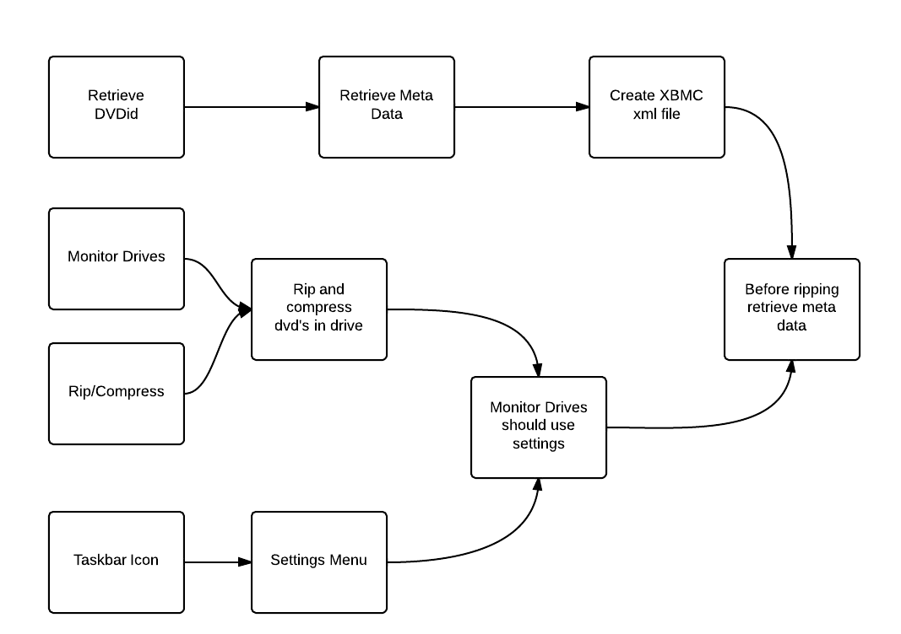

AutoMovieArchive
================

WMI support
-----------

WMI support is enabled by default on most recent versions of Windows. To get support in Python, install the [wrapper library](http://timgolden.me.uk/python/wmi/index.html).
After that, *detector.py* should work as expected: run *detector.py* then insert or remove a drive.
